# IMagDyn

自定义地图的**交互式气候与风场工具**：从灰度全海拔生成海陆遮罩、等高线、月/年均气温与气压风场，并在浏览器中查看。

| | |
|--|--|
| 显示名 | **IMagDyn** |
| Python 包 | `imagdyn` |
| 入口 | `IMagDyn.cmd`（Windows）· `IMagDyn.sh`（Unix） |

典型流程：放入或播种全海拔图 → `ensure` / `contours` → `temperature`（默认同步风场）→ `viewer`。

---

## 界面示例

#### 全海拔地形

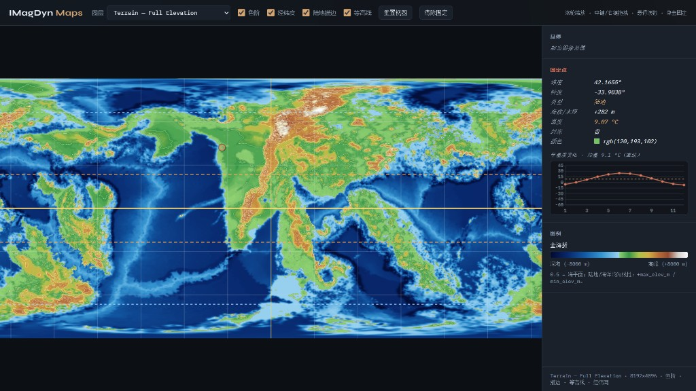

#### 年平均气温

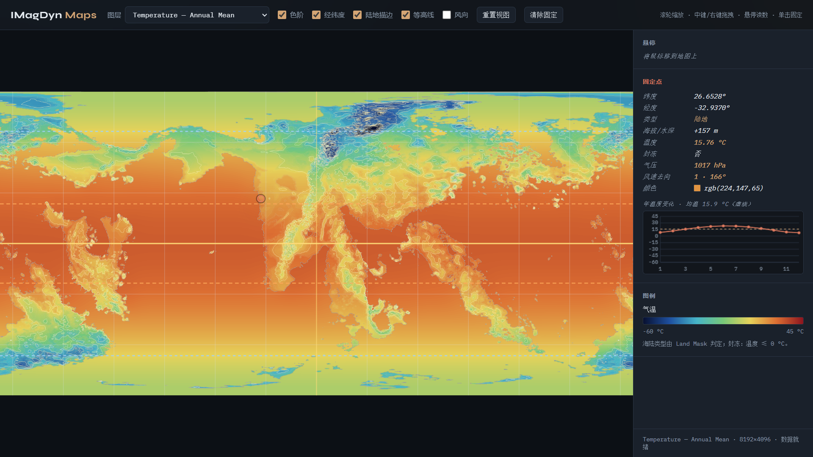

#### 季节气温（6 / 9 / 12）

| 6 月 | 9 月 | 12 月 |
|------|------|------|
| 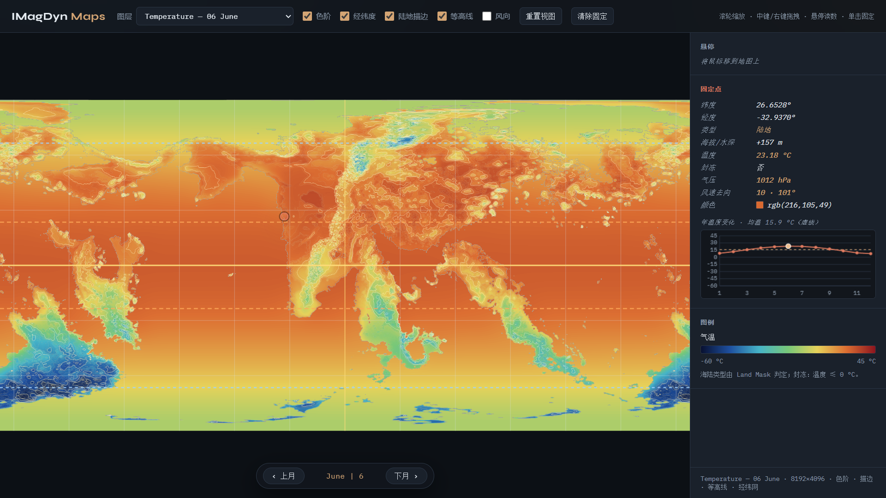 | 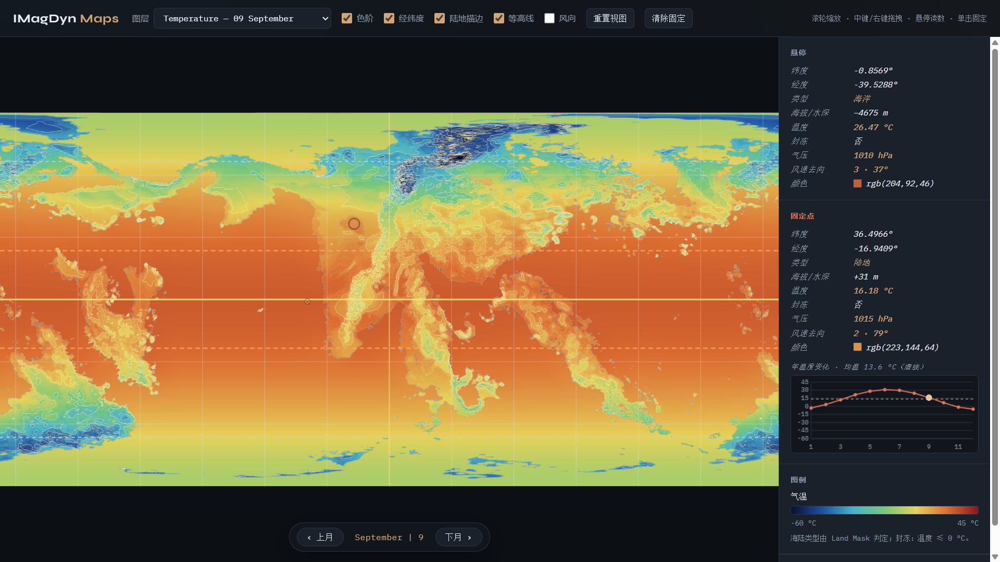 | 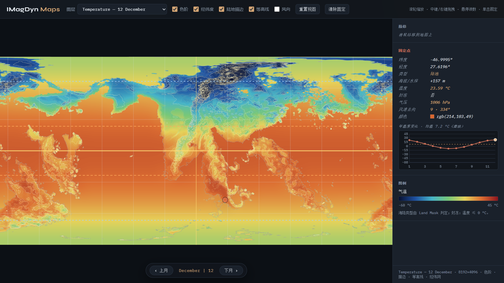 |

#### 年平均气压

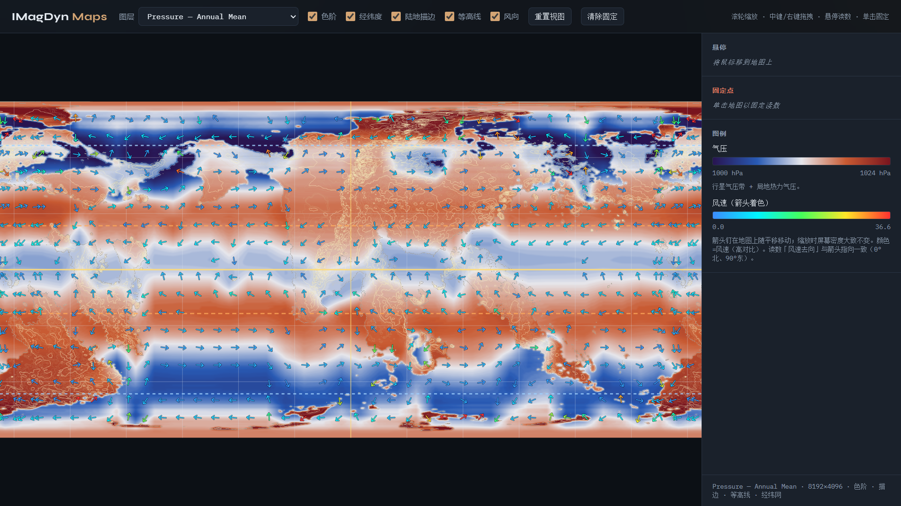

#### 季节气压（6 / 9 / 12 月）

| 6 月 | 9 月 | 12 月 |
|------|------|------|
| 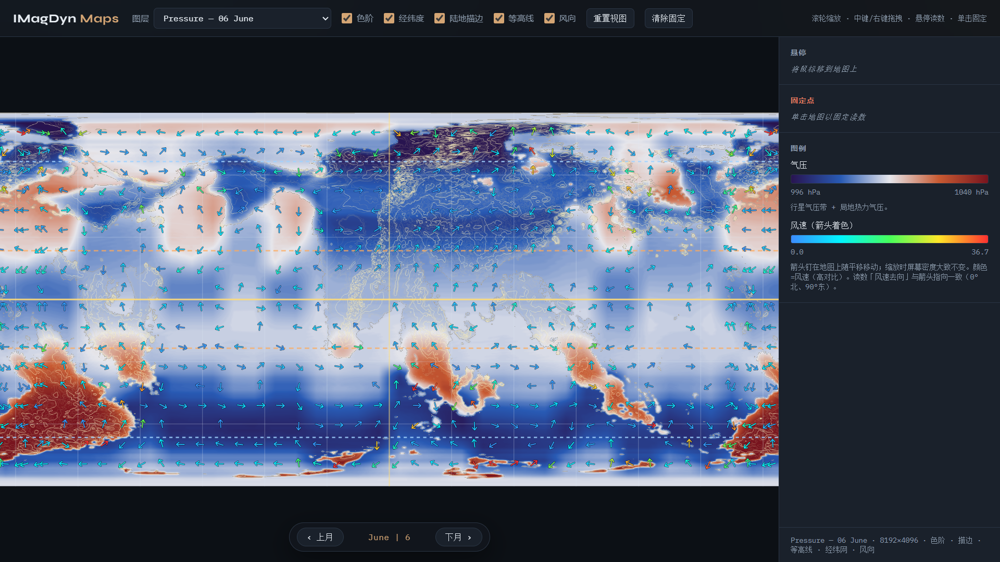 | 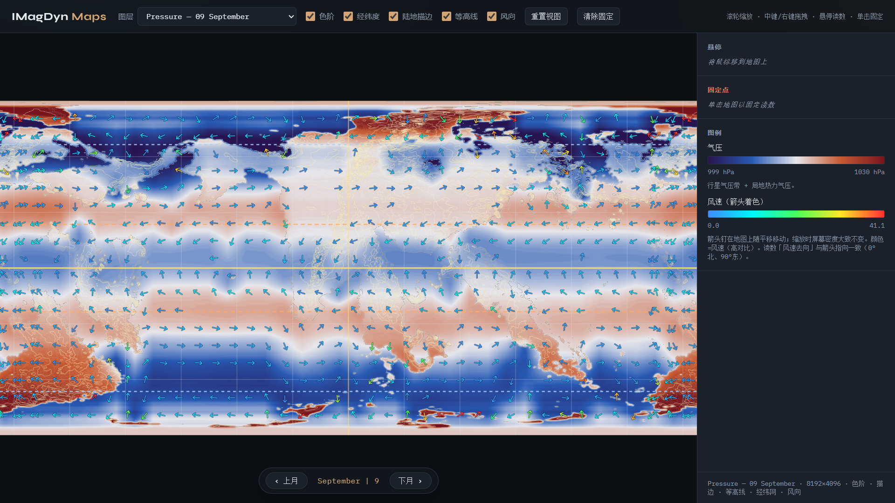 | 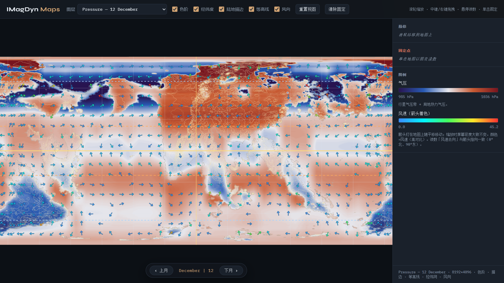 |

#### 季风（6 月 / 12 月）

| 6 月 | 12 月 |
|------|------|
| 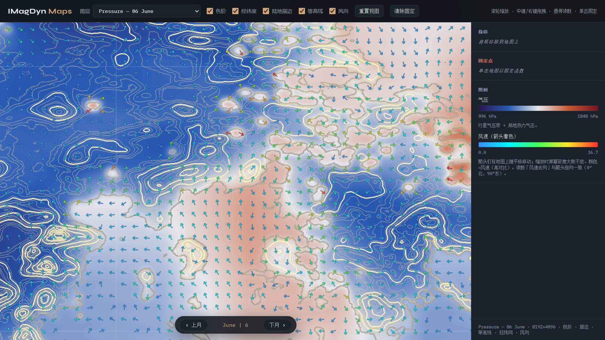 | 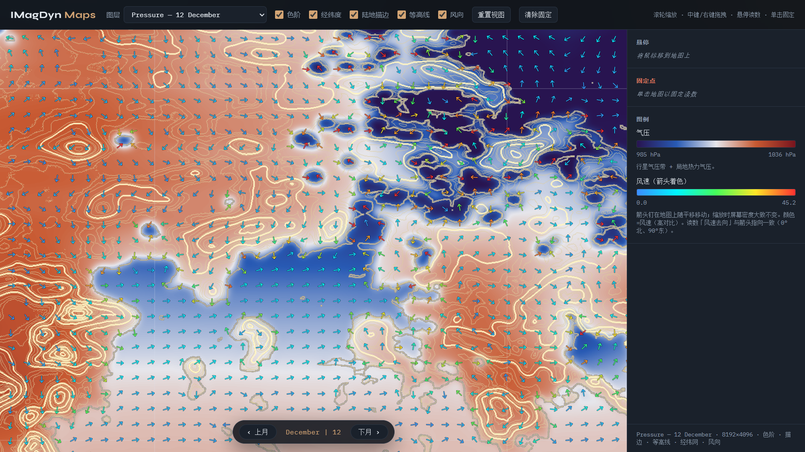 |

---

## 使用手册

### 启动

**无参数**打开交互菜单；**有参数**则直接执行子命令。

```bash
# Windows（可双击）
IMagDyn.cmd

# Linux / macOS / Git Bash
./IMagDyn.sh
```

推荐在安装好依赖的 conda 环境中使用。可在菜单「环境」里设置环境（写入 `.imagdyn_env`）；之后启动会经 `conda run` 进入该环境。

```bash
IMagDyn.cmd --lang zh
./IMagDyn.sh --lang en
python -m imagdyn menu --lang zh
```

可用 `viewer.bat` 只开地图查看器。旧名 `magdyn.cmd` / `magdyn.sh` 仍会转发到新入口。

### 依赖

- Python **3.10+**
- 库：`numpy`、`Pillow`、`scipy`、`torch`
- 推荐：CUDA

```bash
pip install -r requirements.txt
pip install -r requirements-dev.txt   # + pytest / flake8
python -m pytest
```

### 交互菜单

| 键 | 功能 |
|----|------|
| 1 | `status` — 检查资源，写入 `graphs/assets.json` |
| 2 | `ensure` — 从全海拔派生 Land Mask / Above / Below（可从 `graphs/template/` 播种） |
| 3 | `contours` — 陆地等高线 |
| 4 | `temperature` — 12 月 + 年均气温（默认同步风场；`--no-wind` 可关） |
| 5 | `wind` — 风场 / 气压（读取已有气温图） |
| 6 | `summarize` — 气候 / 地形 / 风场统计（含 `wind_stats.json`） |
| 7 | `viewer` — 本地 HTTP 查看器 |
| 8 | `pipeline` — 一键流水线 |
| 9 | **环境** — Python / conda，设置环境并重启 |
| L | 切换中文 / English（`.imagdyn_lang`） |
| 0 | 退出 |

缺依赖时会打印报错并提示激活环境。

### 常用命令

```bash
IMagDyn.cmd status
./IMagDyn.sh ensure
python -m imagdyn viewer --port 8765
python -m imagdyn temperature -- --cpu
python -m imagdyn wind --
python -m imagdyn pipeline --temperature
```

传给气温 / 风场生成器的参数写在 `--` 之后，例如：

```bash
python -m imagdyn temperature -- --cpu --maritime-iters 2 --no-wind
python -m imagdyn wind -- --annual-only --cpu
```

### 推荐流水线

```text
ensure → contours → temperature（含风） → summarize → viewer
```

```bash
./IMagDyn.sh pipeline --temperature
./IMagDyn.sh pipeline --force --temperature   # 强制重建派生地形
./IMagDyn.sh pipeline --wind                  # 已有气温时只补风场
```

| 命令 | 说明 |
|------|------|
| `status` | 列出资源并写 `assets.json` |
| `ensure` | 派生遮罩 / Above / Below；`--force` 强制重建 |
| `contours` | 次级 200 m、主等高线 1000 m |
| `temperature` | 气温图；默认再算风；`--no-wind`、`--cpu` |
| `wind` | 气压 / UV / terrain_dot PNG + meta / stats |
| `summarize` | 终端摘要 + `temperature_stats.json` / `wind_stats.json` |
| `viewer` | [http://127.0.0.1:8765/viewer/](http://127.0.0.1:8765/viewer/)（先 `ensure`） |
| `pipeline` | `ensure` → `contours`；可选 `--temperature` / `--wind` |

### 输入与输出位置

- **输入**：`graphs/Terrain - Full Elevation.png`（0.5 ≈ 海平面）。示例可从 `graphs/template/` 经 `ensure` 播种。
- **气温**：`graphs/temperature/`
- **风场**：`graphs/wind/`
- **查看器**：`./IMagDyn.sh viewer` → 图层、图例、经纬网、风向箭头、悬停/钉点读数

改地形后请重跑 `temperature`（及需要时 `summarize` / `wind`），否则图层可能与新海拔不一致。

数据编码、图层约定与 Viewer 控件说明见下方技术文档链接。

### 本地配置

| 文件 | 用途 |
|------|------|
| `.imagdyn_env` | 首选 conda 环境名 |
| `.imagdyn_lang` | `zh` / `en` |

仍可读旧的 `.magdyn_env` / `.magdyn_lang`。

---

## 技术说明（简要）

流水线概览：

```text
Full Elevation → ensure / contours
              → temperature（辐射 + 海陆惯性 + 洋流 SST）
              → wind（气压带 + 热力气压 → 地转/摩擦平衡 → 地形）
              → summarize / viewer
```

| 主题 | 简述 | 详情 |
|------|--------|------|
| 数据格式 | 海拔灰度、气温 gray、风场 RGB 打包与 JSON 元数据 | [docs/data-formats.md](docs/data-formats.md) |
| 气温 | TOA 日均辐射、热扩散海事缓冲、小湖惯性、洋流 SST | [docs/temperature.md](docs/temperature.md) |
| 风场 / 气压 | 36 经度扇区余弦气压带、瑞利 AMC 副高、二次方阻力 | [docs/wind.md](docs/wind.md) |
| Viewer | 本地静态服务、图层与风箭头、读数钉点 | [docs/viewer.md](docs/viewer.md) |

### 仓库结构

```text
IMagDyn/
├── IMagDyn.cmd / IMagDyn.sh
├── imagdyn/                 # Python 包（cli / temperature / wind / …）
├── viewer/index.html
├── docs/                    # 技术说明与 screenshots/
└── graphs/                  # 地形、气温、风场产物
```

---

## 许可

本项目采用**双许可**，详见 [`NOTICE`](NOTICE)：

| 内容 | 许可 |
|------|------|
| **源代码**（`imagdyn/`、入口脚本、`viewer/` 等） | [GPLv3](LICENSE) |
| **生成文件**（如 `graphs/` 下派生图与 JSON） | [CC BY-SA 4.0](LICENSE.CC-BY-SA-4.0) |

Copyright (C) 2026 DTMosken

使用第三方地图或数据作为输入时，须另行遵守其原有授权；本项目不授予对第三方输入的权利。
