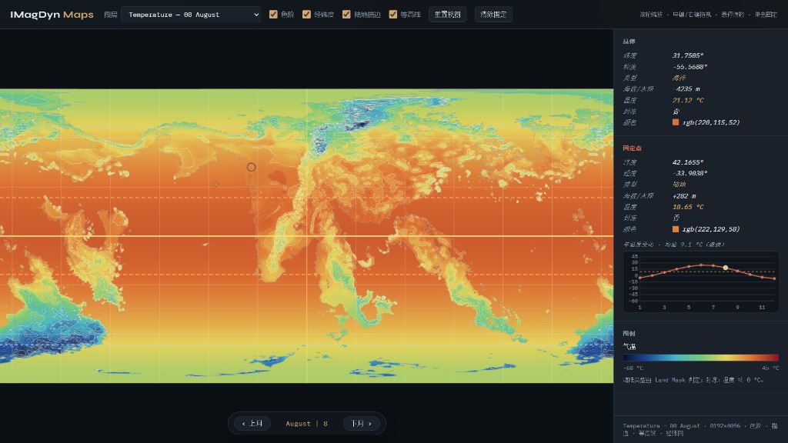
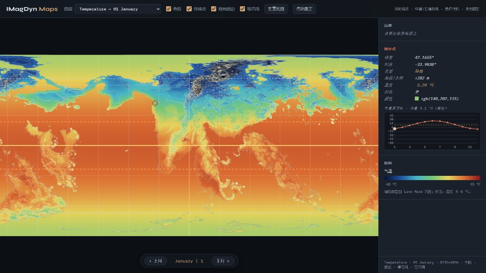

# IMagDyn

自定义地图的**交互式地图与气候工具**：从灰度海拔生成海陆遮罩、等高线与月/年均气温，并在浏览器中查看。

| | |
|--|--|
| 显示名 | **IMagDyn** |
| Python 包 | `imagdyn` |
| 入口 | `IMagDyn.cmd`（Windows）· `IMagDyn.sh`（Unix） |

---

## 快速开始

**无参数**打开交互菜单；**有参数**则直接跑命令。

```bash
# Windows（可双击）
IMagDyn.cmd

# Linux / macOS / Git Bash
./IMagDyn.sh
```

推荐在已装好依赖的 conda 环境中使用（例如 `tf-gpu`）。可在菜单「环境」里设置首选环境（写入 `.imagdyn_env`）；下次启动会用 `conda run` 进入该环境。

```bash
IMagDyn.cmd --lang zh
./IMagDyn.sh --lang en
python -m imagdyn menu --lang zh
```

直接命令示例：

```bash
IMagDyn.cmd status
./IMagDyn.sh ensure
python -m imagdyn viewer --port 8765
python -m imagdyn temperature -- --cpu
python -m imagdyn pipeline --temperature
```

也可用 `viewer.bat` 只开地图查看器。旧名 `magdyn.cmd` / `magdyn.sh` 仍会转发到新入口。

---

## 交互菜单

| 键 | 功能 |
|----|------|
| 1 | `status` — 资源是否齐全，写 `graphs/assets.json` |
| 2 | `ensure` — 从全海拔派生 Land Mask / Above / Below（可从 `graphs/template/` 播种） |
| 3 | `contours` — 陆地等高线 |
| 4 | `temperature` — 12 月 + 年均气温（可问是否强制 CPU） |
| 5 | `summarize` — 气候 / 地形统计 |
| 6 | `viewer` — 本地 HTTP 查看器 |
| 7 | `pipeline` — 一键流水线 |
| 8 | **环境** — 查看 Python / conda，设置首选环境并重启 |
| 9 | 切换中文 / English（存到 `.imagdyn_lang`） |
| 0 | 退出 |

行为要点：

- 缺依赖时**不退出菜单**，打印报错，并提示 `conda activate` 或走「环境」切换。
- 气温交互**不再询问 downsample**。
- Windows 双击启动时，菜单退出或出错后会 `pause`，避免闪退。

---

## 数据约定

### 全海拔 `graphs/Terrain - Full Elevation.png`

单通道灰度，**0.5**（约 gray 128）= 海平面：

| 区间 | 含义 |
|------|------|
| `> 0.5` | 陆地 → 线性 `0 … max_elev_m`（默认 **+8000 m**） |
| `< 0.5` | 海洋 → 线性 `0 … min_elev_m`（默认 **−8000 m**） |

海陆优先读 `Terrain - Land Mask.png`（白 = 陆）。没有遮罩时，`ensure` / viewer 用海拔 `> 0.5` 推导。

本地大图（Full / Above / Below / Land Mask / Satellite）；有一个示例全海拔图（现实地球）在 `graphs/template/` 可选择跑 `2 ensure` 播种。

### 气温 `graphs/temperature/*.png`

```text
gray = clip((T_C − T_MIN) / (T_MAX − T_MIN) × 255)
```

默认 `T_MIN = −60 °C`，`T_MAX = +45 °C`。同目录还有 `temperature_meta.json`、`temperature_stats.json`。

沿海海洋缓冲使用基于PyTorch的 **GPU 热扩散**（对开放洋面 mask 做多次可分离均值滤波）。相关参数：`--maritime-efold-km`、`--maritime-diffuse-passes` 等（见 `python -m imagdyn temperature -- --help`）。

洋流微调（独立模块 `imagdyn.currents`）：海岸线边缘检测后，大陆**东岸暖流 / 西岸寒流**，纬度权重为峰值约 **30°** 的高斯函数；在生成**基础海水 SST 目标**时自动叠加（`--no-currents` 可关）。湿度修正仅占位。诊断图：`python -m imagdyn currents -- --dump-maps`。

---

## 推荐流水线

```text
ensure → contours → temperature → summarize → viewer
```

```bash
./IMagDyn.sh pipeline --temperature
# 或强制重建派生地形：
./IMagDyn.sh pipeline --force --temperature
```

| 命令 | 说明 |
|------|------|
| `status` | 列出资源并写 `assets.json` |
| `ensure` | 派生遮罩 / Above / Below；`--force` 强制重建 |
| `contours` | 次级 200 m、主等高线 1000 m |
| `temperature` | PyTorch，优先 CUDA；`--cpu`、`--downsample N` |
| `summarize` | 终端摘要 + `temperature_stats.json` |
| `viewer` | `http://127.0.0.1:8765/viewer/`（先 `ensure`） |
| `pipeline` | `ensure` → `contours`；可选 `--temperature` |
| `reshape` | **仅本地**：需存在 `imagdyn/reshape.py` |

气温子命令若要把参数传给生成器，在 `--` 之后写，例如：

```bash
python -m imagdyn temperature -- --cpu --maritime-iters 2
```

---

## 目录结构

```text
IMagDyn/   (仓库根目录)
├── LICENSE                    # 源代码：GPLv3
├── LICENSE.CC-BY-SA-4.0       # 生成文件：CC BY-SA 4.0
├── NOTICE                     # 双许可说明
├── IMagDyn.cmd / IMagDyn.sh   # 主入口
├── magdyn.cmd / magdyn.sh     # 兼容转发
├── viewer.bat
├── imagdyn/                   # Python 包
│   ├── cli.py
│   ├── interactive.py         # 双语菜单
│   ├── envutil.py             # conda 探测 / 首选环境
│   ├── assets.py
│   ├── contours.py
│   ├── temperature.py         # 气温 + GPU 扩散缓冲
│   ├── summarize.py
│   ├── timing.py
│   └── reshape.py             # 可选，本地-only
├── viewer/index.html
├── docs/screenshots/          # README 界面示例图
└── graphs/
    ├── assets.json
    ├── template/              # 可选种子 Full Elevation
    ├── Terrain - *.png
    ├── Satellite Color.png    # 可选
    └── temperature/
```

配置文件（本地）：

| 文件 | 用途 |
|------|------|
| `.imagdyn_env` | 首选 conda 环境名 |
| `.imagdyn_lang` | `zh` / `en` |

仍可读旧的 `.magdyn_env` / `.magdyn_lang`。

---

## Viewer

```bash
./IMagDyn.sh viewer
# → http://127.0.0.1:8765/viewer/
```

- **图层**：缺卫星图则隐藏该项；气温按实际文件加载  
- **图例**：常显；色阶 / 陆地描边 / 等高线 / **经纬网** 可开关  
- **经纬网**：30° 网格；赤道、回归线（±23.5°）、极圈（±66.5°）
- **等高线**：次级等高线200m，主等高线 1000 m（加粗）
- **读数**：悬停与钉点（经纬、海陆、海拔或水深、气温）；钉点可看全年气温曲线  
- **资源**：优先 `graphs/assets.json`，否则逐文件探测  

### 界面示例

#### 全海拔地形（Terrain - Full Elevation）


#### 年平均气温（Temperature - Annual Mean）


#### 8 月气温（Temperature - 08 August）



#### 1 月气温（Temperature - 01 January）



---

## 依赖

- Python **3.10+**
- 通用：`numpy`、`Pillow`、`scipy`（`summarize` 海岸采样等）
- 气温：`torch`（使用 CUDA 显卡加速；`--cpu` 可强制 CPU）

```bash
pip install -r requirements.txt          # 运行时
pip install -r requirements-dev.txt      # + pytest / flake8
python -m pytest
```

---

## 许可

本项目采用**双许可**，详见仓库根目录 [`NOTICE`](NOTICE)：

| 内容 | 许可 | 全文 |
|------|------|------|
| **源代码**（`imagdyn/`、入口脚本、`viewer/` 等） | [GNU GPLv3](https://www.gnu.org/licenses/gpl-3.0.html) | [`LICENSE`](LICENSE) |
| **生成文件**（含 JSON、文本、图片等，例如 `graphs/` 下派生地形、等高线、气温图与相关元数据） | [CC BY-SA 4.0](https://creativecommons.org/licenses/by-sa/4.0/) | [`LICENSE.CC-BY-SA-4.0`](LICENSE.CC-BY-SA-4.0) |

Copyright (C) 2026 DTMosken

使用第三方地图或数据作为输入时，须另行遵守其原有授权；本项目不授予对第三方输入的权利。生成物在纳入此类材料时，可能同时受上游许可约束。

---

## 备注

- 改地形后请重跑 `temperature`（及需要时 `summarize`），否则气温层可能与新海拔不一致。  
